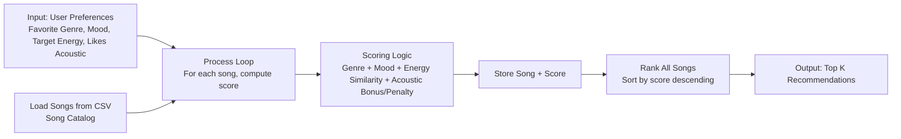
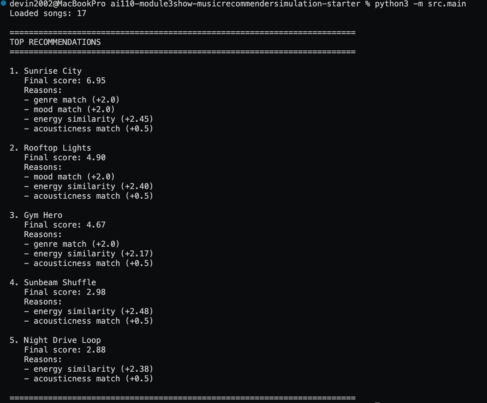
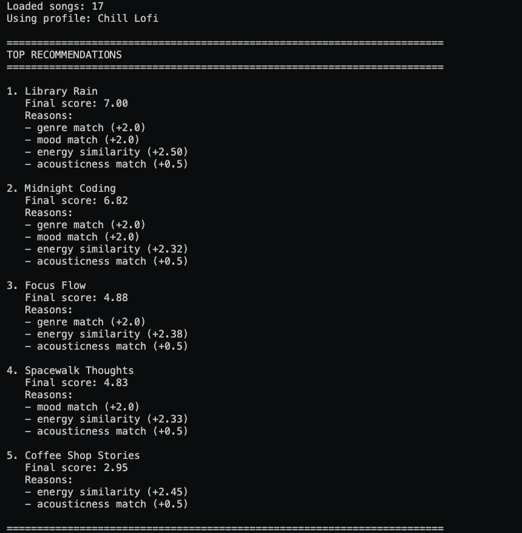
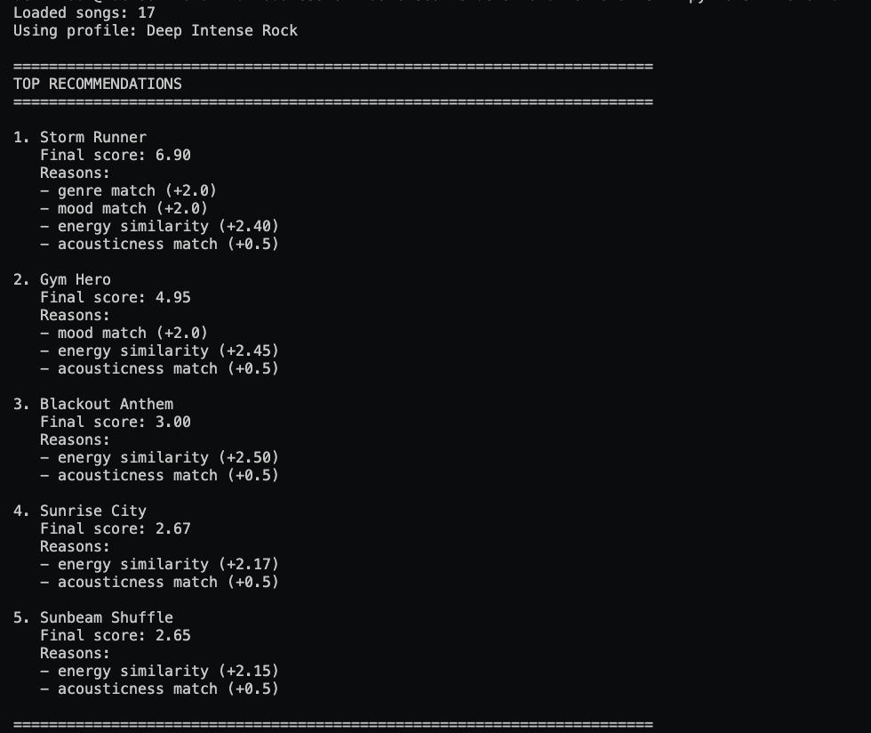
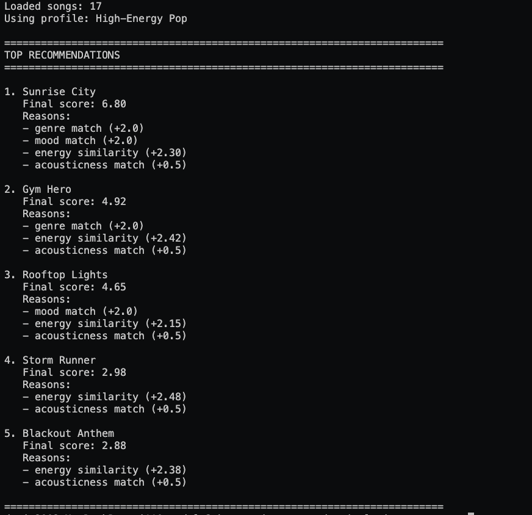

# 🎵 Music Recommender Simulation

## Project Summary

In this project, I build a transparent, rule-based music recommender that loads a CSV catalog, scores each song against a user taste profile, and returns the top matches with plain-language reasons. The scoring combines genre match (+1.0), mood match (+2.0), energy similarity (up to +5.0), and an acoustic preference adjustment (+0.5 or -0.25), then ranks songs by total score. It supports both functional and object-oriented APIs, includes predefined and adversarial user profiles for stress testing, and emphasizes explainability so every recommendation can be traced back to specific feature-level decisions.

---

## How The System Works

Real-world recommenders use patterns from user behavior and item metadata to predict what someone will enjoy next. This simulation focuses on a transparent content-based approach: it compares each song's attributes to a user taste profile, assigns a score, and returns the highest-scoring songs. The goal is to make the logic easy to inspect while still producing recommendations that feel relevant.

Features used in the simulation:

- `Song` fields: `id`, `title`, `artist`, `genre`, `mood`, `energy`, `tempo_bpm`, `valence`, `danceability`, `acousticness`
- `UserProfile` fields: `favorite_genre`, `favorite_mood`, `target_energy`, `likes_acoustic`

Finalized Algorithm Recipe:

- Start each song at `0.0` points.
- If `song.genre == user.favorite_genre`: add `+1.0`.
- If `song.mood == user.favorite_mood`: add `+2.0`.
- Compute energy similarity: `energy_match = max(0, 1 - abs(song.energy - user.target_energy))`.
- Add weighted energy points: `+ (energy_match * 5.0)`.
- Acoustic preference rule:
   - If `(song.acousticness >= 0.5) == user.likes_acoustic`: add `+0.5`.
   - Otherwise: subtract `-0.25`.
- Final score is the sum of all parts above.

Compact formula:

`score = 1.0*genre_match + 2.0*mood_match + 5.0*max(0, 1 - |energy - target_energy|) + acoustic_adjustment`

where `acoustic_adjustment` is `+0.5` for a match and `-0.25` for a mismatch.

Potential bias note:

This system may over-prioritize exact genre and mood matches, so it can miss songs that are musically very close in energy and feel but use different labels. It can also under-recommend niche or less-represented genres if the dataset is imbalanced.

How recommendations are chosen:

- Score every song in the catalog
- Sort songs from highest score to lowest score
- Return the top `k` songs (for example, top 5) with short explanations of why they matched

Simple flow:

`UserProfile + Song features -> feature match scores -> total score -> sort -> top-k recommendations`

Data flow diagram (Mermaid.js):




---

## Getting Started

### Setup

1. Create a virtual environment (optional but recommended):

   ```bash
   python -m venv .venv
   source .venv/bin/activate      # Mac or Linux
   .venv\Scripts\activate         # Windows

2. Install dependencies

```bash
pip install -r requirements.txt
```

3. Run the app:

```bash
python -m src.main
```

### CLI Output Screenshot



### Example Mood Images

These images can be used to show the kinds of listening moods the recommender is aiming to capture:







### Running Tests

Run the starter tests with:

```bash
pytest
```

You can add more tests in `tests/test_recommender.py`.

---

## Experiments You Tried

Use this section to document the experiments you ran. For example:

- What happened when you changed the weight on genre from 2.0 to 0.5
- What happened when you added tempo or valence to the score
- How did your system behave for different types of users

### Adversarial / Edge-Case Profiles

The runner in `src/main.py` includes an `ADVERSARIAL_USER_PROFILES` dictionary you can use for stress-testing scoring behavior.

Profiles included:

- `Conflicting Mood-Energy`: `ambient + sad + target_energy=0.95`
- `String Bool Trap`: `likes_acoustic="False"` (tests Python bool coercion)
- `Out-Of-Range High Energy`: `target_energy=5.0`
- `Out-Of-Range Low Energy`: `target_energy=-2.0`
- `Unknown Category Labels`: genre/mood not in catalog
- `Empty Category Inputs`: blank genre and mood
- `Whitespace Casing`: extra spaces and mixed case (`"  PoP  "`, `" HAPPY "`)
- `Type Coercion Categories`: non-string categorical inputs (`["pop"]`, `None`)
- `Acoustic Preference Conflict`: high energy target with acoustic preference
- `Tie Heavy Baseline`: near-flat categorical matching (`"none"`, `"none"`)

How to run one quickly:

1. Open `src/main.py`
2. Set `selected_profile` to one of the adversarial keys
3. Run `python -m src.main`
4. Inspect top results and explanation reasons for unexpected weighting behavior

---

## Limitations and Risks

This simulation is intentionally simple and transparent, which makes it easy to inspect but also creates important limitations:

- Small and static catalog: recommendations are only as good as the songs in `data/songs.csv`, so niche tastes may be poorly served.
- Label dependence: exact genre and mood labels drive matching, so similar songs with different tags can be missed.
- Strong energy influence: energy similarity has the largest weight (`x5.0`), which can overpower other musical qualities.
- No learning from behavior: the system does not adapt from skips, likes, or listening history over time.
- Limited feature understanding: it ignores lyrics, language, cultural context, and artist relationships.
- Type and range robustness risks: edge-case profiles show that string booleans (for example, `"False"`) and out-of-range energy values can produce misleading scores if inputs are not validated.
- Diversity and novelty risk: simple top-k ranking may repeatedly surface similar songs instead of diverse recommendations.

Potential mitigations:

- Add input validation and normalization (especially booleans and energy bounds).
- Rebalance or tune weights using evaluation profiles rather than fixed assumptions.
- Add diversity constraints (for example, artist or genre spread in top-k).
- Expand catalog coverage and improve metadata quality.

I discuss these trade-offs in more depth in the model card.

---

## Reflection

Read and complete `model_card.md`:

[**Model Card**](model_card.md)

Write 1 to 2 paragraphs here about what you learned:

- about how recommenders turn data into predictions
- about where bias or unfairness could show up in systems like this


---

## 7. `model_card_template.md`

# Profile Pair Reflections

## High-Energy Pop vs Chill Lofi
High-Energy Pop produced upbeat, punchy tracks like Sunrise City, while Chill Lofi shifted toward softer songs like Library Rain and Midnight Coding. This difference makes sense because the Chill Lofi profile asks for lower energy and acoustic-friendly songs, so the system favors calmer tracks.

## High-Energy Pop vs Deep Intense Rock
Both profiles included very energetic songs, which is why Gym Hero appeared in both outputs. The key difference is that Deep Intense Rock pushed Storm Runner to the top because it matches intense mood and rock genre better. This makes sense: similar energy can overlap, but mood and genre decide which song ranks first.

## Chill Lofi vs Deep Intense Rock
Chill Lofi recommended low-energy, mellow songs, while Deep Intense Rock recommended heavier, high-energy songs like Storm Runner and Blackout Anthem. This change is expected because the two profiles ask for opposite vibes: relaxed and acoustic versus intense and non-acoustic.

---

# 🎧 Model Card: Music Recommender Simulation

## 1. Model Name  

**VibeMatch Classroom 1.0**

---

## 2. Intended Use  

This recommender suggests songs from a small catalog.
It uses a few user preferences like genre, mood, energy, and acoustic taste.
It assumes users can describe their taste with those simple settings.
This project is for classroom exploration, not for production users.

---

## 3. How the Model Works  

Each song has features like genre, mood, energy, and acousticness.
The user also gives favorite genre, favorite mood, target energy, and acoustic preference.
The model gives points for genre and mood matches.
It also gives more points when song energy is close to the user target.
I kept the starter scoring style but added clearer explanations for why each song was ranked.

---

## 4. Data  

The catalog has 17 songs.
It includes genres like pop, lofi, rock, ambient, jazz, hip hop, funk, folk, metal, and classical.
It includes moods like happy, chill, intense, dreamy, dark, reflective, and nostalgic.
I did not add or remove songs.
The dataset is small, so many music styles and cultures are still missing.

---

## 5. Strengths  

The system works well when a user has clear preferences.
The Chill Lofi profile got calm, lower-energy songs, which felt correct.
The Deep Intense Rock profile ranked Storm Runner near the top, which made sense.
The explanations are easy to read and help users understand the ranking.

---

## 6. Limitations and Bias 

One weakness is that energy can dominate the score.
Because of that, very energetic songs can rank high even when genre or mood is only a partial match.
This can create a filter bubble, where users keep seeing songs with similar intensity.
The small dataset also increases bias because some genres have fewer choices.

---

## 7. Evaluation  

I tested High-Energy Pop, Chill Lofi, and Deep Intense Rock profiles.
I checked whether the top songs matched the profile vibe and whether the reasons were believable.
One surprise was that Gym Hero showed up for both Happy Pop and Deep Intense Rock users.
That makes sense because the song has very high energy, and energy has a strong effect in scoring.

---

## 8. Future Work  

I would reduce the energy weight so genre and mood matter more.
I would add more user controls, like tempo range and danceability preference.
I would add a diversity step so the top 5 are not all the same style.
I would expand the song catalog so the model can serve more tastes fairly.

---

## 9. Personal Reflection  

My biggest learning moment was seeing that one weight change can completely reshuffle the top songs.
AI tools helped me move faster by suggesting test ideas, edge cases, and clearer explanations.
I still had to double-check AI suggestions by running profiles, because some ideas sounded good but did not match the actual outputs.
I was surprised that a simple point system can still feel personal when the profile settings clearly match the song features.
If I extend this project, I would add more songs, add a diversity step, and let users tune how much genre, mood, and energy each matter.

