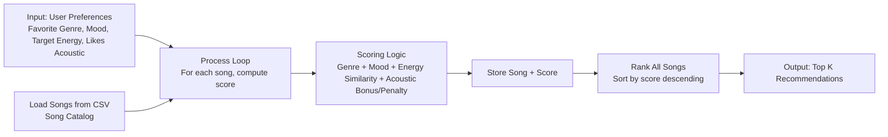

# 🎵 Music Recommender Simulation

## Project Summary

In this project, I build a transparent, rule-based music recommender that loads a CSV catalog, scores each song against a user taste profile, and returns the top matches with plain-language reasons. The scoring combines genre match (+1.0), mood match (+2.0), energy similarity (up to +5.0), and an acoustic preference adjustment (+0.5 or -0.25), then ranks songs by total score. It supports both functional and object-oriented APIs, includes predefined and adversarial user profiles for stress testing, and emphasizes explainability so every recommendation can be traced back to specific feature-level decisions.

---

## How The System Works

Real-world recommenders use patterns from user behavior and item metadata to predict what someone will enjoy next. This simulation focuses on a transparent content-based approach: it compares each song's attributes to a user taste profile, assigns a score, and returns the highest-scoring songs. The goal is to make the logic easy to inspect while still producing recommendations that feel relevant.

Features used in the simulation:

- `Song` fields: `id`, `title`, `artist`, `genre`, `mood`, `energy`, `tempo_bpm`, `valence`, `danceability`, `acousticness`
- `UserProfile` fields: `favorite_genre`, `favorite_mood`, `target_energy`, `likes_acoustic`

Finalized Algorithm Recipe:

- Start each song at `0.0` points.
- If `song.genre == user.favorite_genre`: add `+1.0`.
- If `song.mood == user.favorite_mood`: add `+2.0`.
- Compute energy similarity: `energy_match = max(0, 1 - abs(song.energy - user.target_energy))`.
- Add weighted energy points: `+ (energy_match * 5.0)`.
- Acoustic preference rule:
   - If `(song.acousticness >= 0.5) == user.likes_acoustic`: add `+0.5`.
   - Otherwise: subtract `-0.25`.
- Final score is the sum of all parts above.

Compact formula:

`score = 1.0*genre_match + 2.0*mood_match + 5.0*max(0, 1 - |energy - target_energy|) + acoustic_adjustment`

where `acoustic_adjustment` is `+0.5` for a match and `-0.25` for a mismatch.

Potential bias note:

This system may over-prioritize exact genre and mood matches, so it can miss songs that are musically very close in energy and feel but use different labels. It can also under-recommend niche or less-represented genres if the dataset is imbalanced.

How recommendations are chosen:

- Score every song in the catalog
- Sort songs from highest score to lowest score
- Return the top `k` songs (for example, top 5) with short explanations of why they matched

Simple flow:

`UserProfile + Song features -> feature match scores -> total score -> sort -> top-k recommendations`

Data flow diagram (Mermaid.js):




---

## Getting Started

### Setup

1. Create a virtual environment (optional but recommended):

   ```bash
   python -m venv .venv
   source .venv/bin/activate      # Mac or Linux
   .venv\Scripts\activate         # Windows

2. Install dependencies

```bash
pip install -r requirements.txt
```

3. Run the app:

```bash
python -m src.main
```

### CLI Output Screenshot


### Example Mood Images

These images can be used to show the kinds of listening moods the recommender is aiming to capture:


### Running Tests

Run the starter tests with:

```bash
pytest
```

You can add more tests in `tests/test_recommender.py`.

---

## Experiments You Tried

### Adversarial / Edge-Case Profiles

The runner in `src/main.py` includes an `ADVERSARIAL_USER_PROFILES` dictionary you can use for stress-testing scoring behavior.

Profiles included:

- `Conflicting Mood-Energy`: `ambient + sad + target_energy=0.95`
- `String Bool Trap`: `likes_acoustic="False"` (tests Python bool coercion)
- `Out-Of-Range High Energy`: `target_energy=5.0`
- `Out-Of-Range Low Energy`: `target_energy=-2.0`
- `Unknown Category Labels`: genre/mood not in catalog
- `Empty Category Inputs`: blank genre and mood
- `Whitespace Casing`: extra spaces and mixed case (`"  PoP  "`, `" HAPPY "`)
- `Type Coercion Categories`: non-string categorical inputs (`["pop"]`, `None`)
- `Acoustic Preference Conflict`: high energy target with acoustic preference
- `Tie Heavy Baseline`: near-flat categorical matching (`"none"`, `"none"`)

How to run one quickly:

1. Open `src/main.py`
2. Set `selected_profile` to one of the adversarial keys
3. Run `python -m src.main`
4. Inspect top results and explanation reasons for unexpected weighting behavior

---

## Limitations and Risks

This simulation is intentionally simple and transparent, which makes it easy to inspect but also creates important limitations:

- Small and static catalog: recommendations are only as good as the songs in `data/songs.csv`, so niche tastes may be poorly served.
- Label dependence: exact genre and mood labels drive matching, so similar songs with different tags can be missed.
- Strong energy influence: energy similarity has the largest weight (`x5.0`), which can overpower other musical qualities.
- No learning from behavior: the system does not adapt from skips, likes, or listening history over time.
- Limited feature understanding: it ignores lyrics, language, cultural context, and artist relationships.
- Type and range robustness risks: edge-case profiles show that string booleans (for example, `"False"`) and out-of-range energy values can produce misleading scores if inputs are not validated.
- Diversity and novelty risk: simple top-k ranking may repeatedly surface similar songs instead of diverse recommendations.

Potential mitigations:

- Add input validation and normalization (especially booleans and energy bounds).
- Rebalance or tune weights using evaluation profiles rather than fixed assumptions.
- Add diversity constraints (for example, artist or genre spread in top-k).
- Expand catalog coverage and improve metadata quality.

I discuss these trade-offs in more depth in the model card.

---

## Reflection


[**Model Card**](model_card.md)

[**Profile Pair Reflections**](reflection.md)

---

